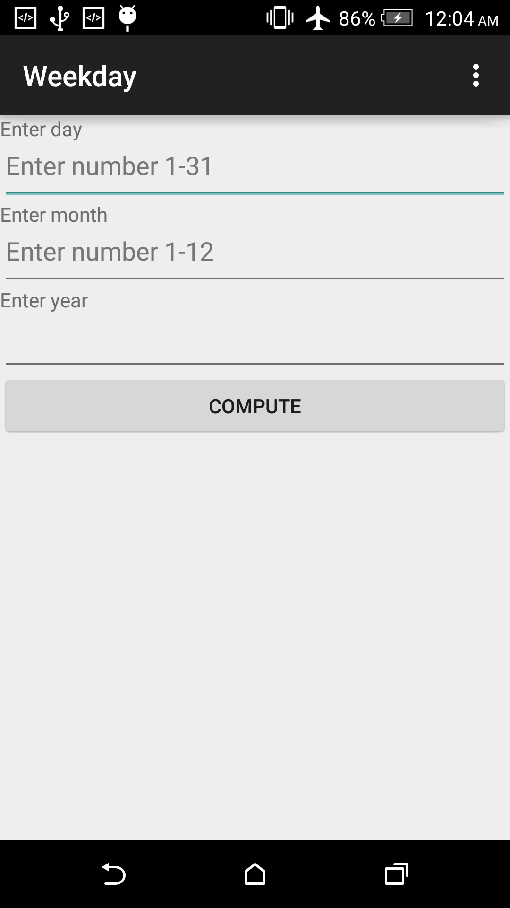
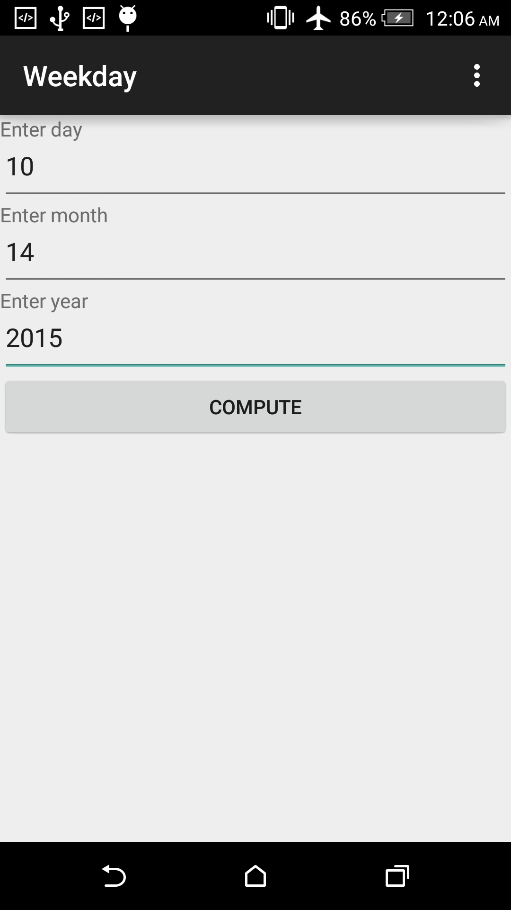

# secondactivityassignment-rohit0000
secondactivityassignment-rohit0000 created by Classroom for GitHub

This demonstrates the use of Intent to pass data between two activities

## Problem:

Design and implement an Android application that determines the day of the week (Sunday through Saturday) given any date entered by the user. You could use this program, for example, to determine what day of the week you were born or what day of the week an upcoming exam is. Use Zeller's congruence algorithm to calculate the day of the week. The output day should be printed in a second Android activity.

## Screenshots

User inputs a date

Output shows in another activity

